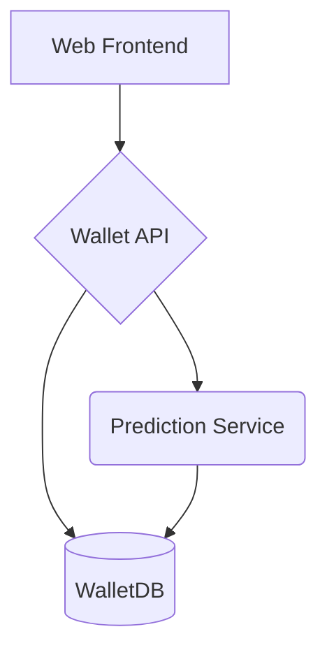

# Smart Personal Budget Assistant (SPBA)

> **Empowering smarter personal finance for everyone!**

---

## Table of Contents
- [Overview](#overview)
- [Architecture](#architecture)
- [Service Breakdown](#service-breakdown)
  - [1. Wallet (API/Backend)](#1-wallet-apibackend)
  - [2. WalletDB (MySQL)](#2-walletdb-mysql)
  - [3. Prediction (AI/ML)](#3-prediction-aiml)
  - [4. Web (Frontend)](#4-web-frontend)
- [System Architecture Diagram](#system-architecture-diagram)
- [Setup & Installation](#setup--installation)
- [API Reference](#api-reference)
- [Database Schema](#database-schema)
- [Advanced Usage](#advanced-usage)
- [Troubleshooting](#troubleshooting)
- [Contributing](#contributing)
- [License & Contact](#license--contact)

---

## Overview

**SPBA** is a multi-service application designed to help users manage personal finances, simulate digital wallets, analyze spending habits, and provide actionable AI-powered insights. It is modular, extensible, and suitable for both technical and non-technical users.

---

## Architecture

SPBA is composed of four main services, each running independently (via Docker Compose):

- **Wallet**: Node.js backend API for wallet and transaction management.
- **WalletDB**: MySQL database for storing wallets and transactions.
- **Prediction**: Python-based AI/ML service for spending prediction and insights.
- **Web**: Modern JavaScript frontend for user interaction.

### System Architecture Diagram




---

## Service Breakdown

### 1. Wallet (API/Backend)
- **Language:** Node.js (ES Modules)
- **Main Entry:** `index.js`
- **Key Dependencies:**
  - `express`, `cors`, `dotenv`, `mysql2`, `axios`, `openai`, `nodemon`
- **Responsibilities:**
  - Exposes RESTful API endpoints for wallet and transaction management
  - Handles authentication (if implemented)
  - Forwards transaction data to Prediction service
  - Integrates with OpenAI for chat/insight features
- **Project Structure:**
  - `index.js`: App entry, sets up Express server and routes
  - `routes/`: Route handlers for `/wallets` and `/chat`
  - `db.js`: Database connection logic
  - `utility.js`: Helper functions
- **How to Run:**
  - `npm install`
  - `npm start` (with `.env`)

#### Example Endpoints
- `GET /wallets`: List all wallets
- `POST /wallets`: Create a new wallet
- `GET /wallets/:id/transactions`: List transactions for a wallet
- `POST /wallets/:id/transactions`: Add a transaction
- `POST /chat`: AI-powered chat endpoint

### 2. WalletDB (MySQL)
- **Type:** Relational Database
- **Schema File:** `services/walletdb/init.d/wallet.sql`
- **Tables:**
  - `wallets`: Stores wallet metadata (id, user_id, provider, etc.)
  - `wallet_transactions`: Stores transaction details (id, wallet_id, user_id, amount, type, category, timestamp, etc.)
- **Sample Data:**
  - Pre-populated with demo wallets and transactions
- **How to Run:**
  - Via Docker Compose (`docker-compose up`)
  - Or manually import `wallet.sql` into your MySQL instance

### 3. Prediction (AI/ML)
- **Language:** Python 3.x
- **Frameworks:** Flask, scikit-learn, pandas, joblib, pymysql, openai
- **Key Files:**
  - `api.py`: Flask API exposing prediction endpoints
  - `engine.py`: Model training, prediction, and insight logic
  - `spba.pkl`: Serialized ML model
- **Responsibilities:**
  - Learns from transaction data to predict future spending
  - Provides insights using GPT via OpenAI
- **Endpoints:**
  - `GET /v1/ai/predict/<user_id>`: Predict next month's spending per category
  - `GET /v1/ai/predict/<user_id>/insights`: AI-generated financial insights
- **How to Run:**
  - `pip install -r requirements.txt`
  - `python api.py`
- **Model Details:**
  - Uses linear regression on monthly categorized spending
  - GPT (via OpenAI) for natural language suggestions

### 4. Web (Frontend)
- **Language:** JavaScript (React, Vite, Tailwind CSS)
- **Key Files:**
  - `src/app.jsx`, `src/main.jsx`: App entry and router
  - `src/components/`: Reusable UI components
  - `src/pages/`: Page-level views (dashboard, analytics, etc.)
  - `src/services/`: API client logic
- **Key Dependencies:**
  - `react`, `@tanstack/react-query`, `@radix-ui/*`, `axios`, `tailwindcss`, `vite`, `formik`, etc.
- **Features:**
  - Dashboard for wallet overview
  - Transaction history and analytics
  - AI-driven insights and predictions
- **How to Run:**
  - `npm install`
  - `npm run dev`

---

## Setup & Installation

### Prerequisites
- [Docker](https://www.docker.com/) (recommended for orchestration)
- Node.js >= 18.x
- Python 3.10+
- MySQL 8+
- OpenAI API key (for AI features)

### Environment Variables
Each service has a `.env.example` file. Copy and fill in as needed:
```bash
cp .env.example .env
cp services/wallet/.env.example services/wallet/.env
cp services/prediction/.env.example services/prediction/.env
cp services/web/.env.example services/web/.env
cp services/walletdb/.env.example services/walletdb/.env
```

### Running with Docker Compose
```bash
git clone <your-repo-url>
cd spba
docker-compose up --build
```
- Access frontend at [http://localhost:3000](http://localhost:3000)
- API at [http://localhost:3001](http://localhost:3001)
- Prediction at [http://localhost:5000](http://localhost:5000)

### Manual Service Startup
- See each service's README or docs for standalone dev mode

---

## API Reference

### Wallet API (Node.js)
| Method | Endpoint | Description |
|--------|----------|-------------|
| GET    | /wallets | List all wallets |
| POST   | /wallets | Create wallet |
| GET    | /wallets/:id/transactions | List transactions |
| POST   | /wallets/:id/transactions | Add transaction |
| POST   | /chat    | AI chat/insight |

### Prediction API (Python/Flask)
| Method | Endpoint | Description |
|--------|----------|-------------|
| GET    | /v1/ai/predict/<user_id> | Predict spending |
| GET    | /v1/ai/predict/<user_id>/insights | AI insights |

---

## Database Schema

### wallets
| Field      | Type           | Description |
|------------|----------------|-------------|
| id         | INT, PK, AI    | Wallet ID   |
| user_id    | INT            | User ID     |
| provider   | VARCHAR(50)    | Provider    |
| source     | ENUM           | Source (`bank`, `momo`) |
| label      | VARCHAR(100)   | Wallet label|
| is_active  | BOOLEAN        | Active flag |
| created_at | DATETIME       | Created     |

### wallet_transactions
| Field      | Type           | Description |
|------------|----------------|-------------|
| id         | INT, PK, AI    | Transaction ID |
| wallet_id  | INT, FK        | Wallet FK      |
| user_id    | INT            | User ID        |
| source     | ENUM           | Transaction source |
| amount     | DECIMAL(10,2)  | Amount         |
| type       | ENUM           | `credit`/`debit` |
| description| VARCHAR(255)   | Description    |
| category   | VARCHAR(100)   | Category       |
| timestamp  | DATETIME       | Timestamp      |

---

## Advanced Usage

### Training the AI Model
- Run `engine.py` to retrain the model if new data is added
- Model output saved as `spba.pkl`

### Customizing Categories
- Edit `wallet.sql` and frontend code to add new spending categories

### Integrating More AI
- Swap OpenAI models in `engine.py` and backend as needed

### Security & Privacy
- Use strong secrets in `.env` files
- Never commit real API keys or credentials

---

## Troubleshooting
- **Docker Issues:** Ensure ports 3000, 3001, and 5000 are free
- **MySQL Errors:** Confirm `wallet.sql` is loaded and DB credentials are correct
- **AI/Prediction Errors:** Check OpenAI API key and Python dependencies
- **Frontend Not Loading:** Run `npm install` in `/web` and check Vite logs

---

## License & Contact
- MIT License (see LICENSE)
- For questions, open an issue or contact maintainers

---

*This project is built for learning, experimentation, and empowering smarter personal finance for everyone!*